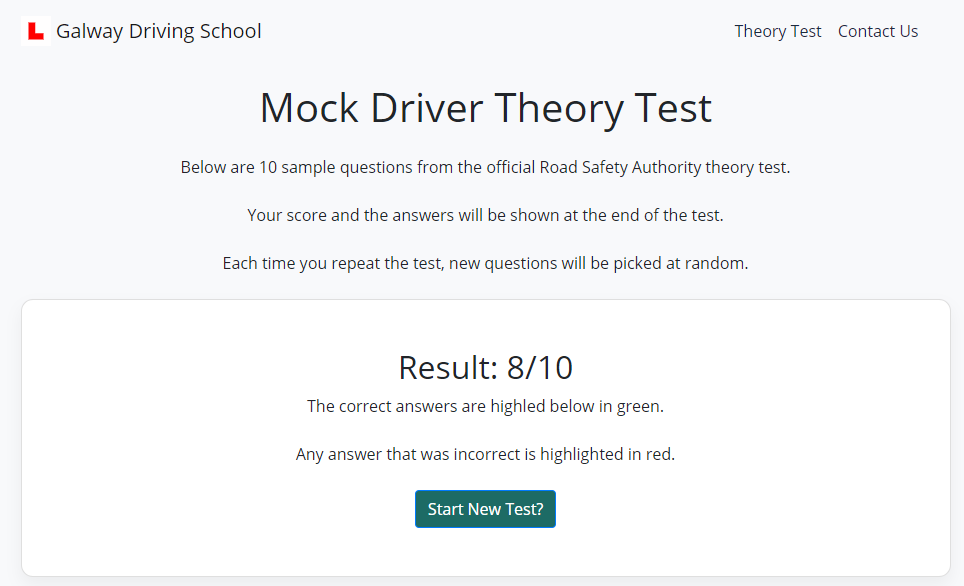
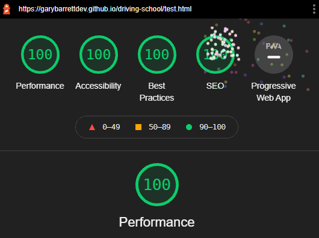

<h1>Galway Driving School</h1>

[View the site here.](https://garybarrettdev.github.io/driving-school)

This is a website for a driving school.

The site contains a multiple-choice exam that mimics the [official Road Safety Authority driver theory test](https://theorytest.ie/), which all learner drivers need to pass in Ireland. It also has a contact form to contact the site owner.

## Table of Contents

* [Site Owner Goals](https://github.com/GaryBarrettDev/driving-school#site-owner-goals)
* [User Experience](https://github.com/GaryBarrettDev/driving-school#user-experience-ux)
* [Design](https://github.com/GaryBarrettDev/driving-school#design)
    * [Colour Scheme](https://github.com/GaryBarrettDev/driving-school#colour-scheme)
    * [Typography](https://github.com/GaryBarrettDev/driving-school#typography)
    * [Imagery](https://github.com/GaryBarrettDev/driving-school#imagery)
    * [Wireframes](https://github.com/GaryBarrettDev/driving-school#wireframes)
    * [Features](https://github.com/GaryBarrettDev/driving-school#features)
    * [Technologies used](https://github.com/GaryBarrettDev/driving-school#technologies-used)
    * [Languages used](https://github.com/GaryBarrettDev/driving-school#languages-used)
    * [Frameworks, Libraries & Programs Used](https://github.com/GaryBarrettDev/driving-school#frameworks-libraries--programs-used)

* [Testing](https://github.com/GaryBarrettDev/driving-school#testing)

     * [Code validation](https://github.com/GaryBarrettDev/driving-school#code-validation)
    * [Responsive Testing](https://github.com/GaryBarrettDev/driving-school#responsive-testing)
    * [Further Testing](https://github.com/GaryBarrettDev/driving-school#further-testing)
    * [Testing User Stories from User Experience (UX) Section](https://github.com/GaryBarrettDev/driving-school#testing-user-stories-from-user-experience-ux-section)

* [Troubleshooting Google Maps](https://github.com/GaryBarrettDev/driving-school#troubleshooting-google-maps)

* [Features to be implemented](https://github.com/GaryBarrettDev/driving-school#features-to-be-implmented)

* [Deployment](https://github.com/GaryBarrettDev/driving-school#deployment)
  

 *  [Credits](https://github.com/GaryBarrettDev/driving-school#credits)
    * [Media](https://github.com/GaryBarrettDev/driving-school#media)    
    * [Content](https://github.com/GaryBarrettDev/driving-school#content)
    * [Code](https://github.com/GaryBarrettDev/driving-school#code)
    * [Acknowledgements](https://github.com/GaryBarrettDev/driving-school#acknowledgements)

----

## Site Owner Goals

As the site owner, I want visitors:
- to be abe to contact me through a contact form if they wish to book lessons
- to be able to see where my business is located
- to be able to practice a mock exam that mimics the real driver theory test
 

---
  
## User Experience (UX)

 #### First Time Visitor Goals

As a First Time Visitor:

 - I want to know where the business is located.

- I want to know how I can contact the site owner.

 - I want to to be able to contact the business on social media.

 - I want to able to practice answering sample test questions before I sit my driver theory test.
  
### Returning and Frequent Visitor Goals

Returning and frequent visitors' goals are the same as those of first time visitors - practice test questions and the ability to contact the site owners.
  ___

### Design

#### Colour Scheme

The main colours used are green with a light gray background. 

-  `#288D85`
-  `#F8F9FB`

According to an article on [the science of colour persuasion](https://idealogicbrandlab.com/color-persuasion/):

> (Green suggests)...health, tranquility, growth, freshness, prosperity, hope, and nature. Used to promote environmental issues. Green can encourage balance and harmony. 

#### Typography

Open Sans is the main font used throughout the whole website with Sans Serif as the fallback font. According to [Google](https://fonts.google.com/specimen/Open+Sans#glyphs):
>(Open sans)...was optimized for print, web, and mobile interfaces, and has excellent legibility characteristics in its letterforms.

 #### Imagery
 
Illustrated hero images are used on the home page to  provide a welcoming experience for visitors. Scalable vector graphics are used to keep images sharp while minimizing page load times.

___  

 ### Mockups and Wireframes

  
- [Test Page ](assets/images/docs/test-question-card-wireframe.png ) (The same one column design is used across all screensizes)
- [Contact Page Mobile](assets/images/docs/contact-mobile-wireframe.png)
    - [Contact Page Desktop](assets/images/docs/contact-desktop-wireframe.png)
- [Index Page Mobile](assets/images/docs/index-mobile-wireframe.png)
    - [Index Page Desktop](assets/images/docs/index-desktop-wireframe.png)

## Features

* Responsive menu
    - The navigation menu uses Bootstrap's javascript to create a toggle on mobile devices, 
    providing an easy way for users to navigate the site.
    

* Mock Theory Test
    * The official driver theory test, involving multiple-choice questions, is recreated with javascript to help learner drivers prepare and practice before taking the real exam.

*   Contact Form
    * A contact form using the API from Emailjs.com allows visitors to send a message via email to the site owners.

*   Google Maps
    * Google maps is used on the contact page to help users find where the business is located

* Footer Social icons
    * Social icons in the footer, created with Font Awesome in the footer, help promote the site owners social media accounts.

## Technologies Used

### Languages Used

-  [HTML5](https://en.wikipedia.org/wiki/HTML5)

-  [CSS3](https://en.wikipedia.org/wiki/Cascading_Style_Sheets)

- [Javascript](https://www.javascript.com) for the muti-choice test.

### Frameworks, Libraries & Programs Used

[Emailjs.com](https://emailjs.com)
- API used to give the contact form the ability to send emails

 [Bootstrap 4.6.0:](https://getbootstrap.com/docs/4.6/getting-started/introduction/)

- Bootstrap was used to assist with the responsiveness and structure of the site.

[Font Awesome 5.15.0:](https://fontawesome.com/)

- Font Awesome was used to create the social icons in the footer.

 [Google Fonts:](https://fonts.google.com/)

- Google Fonts was used to add 'Open Sans' 

 [jQuery:](https://jquery.com/)

- jQuery used by Bootstrap for the collapsible mobile menu.

[Git](https://git-scm.com/) and [Gitpod](https://gitpod.io/)

- Git was used for version control by utilizing the Gitpod terminal to commit to Git and Push to GitHub.

[GitHub:](https://github.com/)

- GitHub is used to store the projects code after being pushed from Gitpod.

[Sketch](Sketch.com) and [Bootstrap UI for Sketch](http://bootstrap-sketch.com/)
- Sketch was used to create the wireframes. Bootstrap UI was used to add default Bootsrap elements such as the hamburger icon, buttons, forms, and cards to the wireframes.

---

## Testing

  ### Code validation

The W3C HTML Validator and W3C CSS Validator Services were used to validate the project to ensure there were no syntax errors in the project.

[W3C Markup Validator](https://validator.w3.org) 
- [Home page Results](https://validator.w3.org/nu/?doc=https%3A%2F%2Fgarybarrettdev.github.io%2Fdriving-school%2F) 
- [Test page Results](https://validator.w3.org/nu/?doc=https%3A%2F%2Fgarybarrettdev.github.io%2Fdriving-school%2Ftest.html) (Note: the warning about empty headings is because the content for those will be populated by javascript based on users' interactions)
- [Contact page Results](https://validator.w3.org/nu/?doc=https%3A%2F%2Fgarybarrettdev.github.io%2Fdriving-school%2Fcontact.html)

[W3C CSS Validator](https://jigsaw.w3.org/css-validator/#validate_by_input) - [Results](assets/docs/images//css-validation.png)

[Jshint.com ](https://jshint.com)
 - No errors were found

[Google Lighthouse](https://developers.google.com/web/tools/lighthouse)
- Found  issues with contrast, size of the social icons, and non-sequential headings. These issues were  were fixed for accessibility.

___
### Responsive Testing

The site's repsonsiveness was tested using:

- [Google's Mobile Friendly Tester](https://search.google.com/test/mobile-friendly)
-  [Responsinator](https://www.responsinator.com/) 
- [Chrome DevTools' Device Mode](https://developers.google.com/web/tools/chrome-devtools/device-mode)

The site was also tested by manually resizing the browser to check for any issues at uncommon screen sizes.

No issues were found.

---

### Contact Form Testing

- Form validation was tested to make sure all required fields function correctly.
- Emailjs.com's API integration was tested to make  sure emails from the contact form were sent correctly
- The success message correctly displays when the email is sent.

### Multiple-Choice Quiz Testing
Tested that:
- questions are shuffled
- next & previous buttons function and appear at the correct time
- user can change their answers
- scores are calculated and shown to users
- answers selected are highlighted by whether they're right or wrong
- button to restart the test functions

### Google Maps
Tested across devices and screensizes to make sure it was responsive and that users could interact with it.

### Further Testing
- Footer social icon links were tested to make sure they open in another tab.
- Navigation menu and buttons were tested to make sure they linked to the correct destinations.

___

### Testing User Stories from User Experience (UX) Section

####  Visitor Goals

1) I want to know where the business is located.
    - There's a Google Map on the contact page with the business location.
    
2) I want to be able to contact the site owner.
    - There's a contact form that can be used to email the site owners.
    - Form fields are validated to make sure all details are sent correctly
    - A success message is diplayed to the uers when a message is sent.

3) I want to to be able to contact the business on social media.
    - Footer icons provide easy navigation to the businesses social media accounts.

4) I want to able to practice answering sample test questions before I sit my driver theory test.
    - The mock multi-choice test helps visitors prepare for the real test.

As the site owner goals essentially match those of visitors, their needs were also met.

---

## Troubleshooting Google Maps

I intended to use the Google Maps API on the contact page.

However, Google suspended my billing account due to possible fraudulent activity associated with my credit card. A screenshot of their email [can be viewed here](assets/images/docs/google-maps-api-billing.png).

I sent them verification documents, but haven't yet recieved a reply.

As a result, I did not have access to their API.

As a workaround, I added a Google Map via an embedded iframe, then used [CSS to make it responsive without any overflow issues](https://github.com/GaryBarrettDev/driving-school/blob/21cb65913ed506a86cdf8a29b844501255568ba4/assets/css/style.css#L41).

While this isn't ideal, it does help visitors achieve their goals by providing them with an interactive map they can use to locate the business.

I tried looking for alternative map API's that could be used, but none seemd to be as user friendly for visitors as Google Maps.

----

## Features to be implemented
- Backend that allows users to create accounts
- Booking calender to allow users to pick when they want to take lessons
- Payment gateway so visitors can pay for lessons with their credit cards.

I considered adding a timer to the quiz, but decided against it. The aim of the quiz is for accuracy - to help people learn, it's not for speed.

The official test requires drivers to answer 40 questions in 45 minutes. 

Ideally, I'd like to be able to recreate that full test with a 45 minute timer if visitors want to practice it. However, there are over 800 possible questions on the test, and no API to pull them from - the company that runs the test [charges a monthly fee for access to revision material](https://dttstore.prometric.com/categories/car-theory-test).

---

## Deployment

The project was deployed to GitHub Pages using the following steps:

1. Log in to GitHub and navigate to the [Driving School GitHub Repository](https://github.com/GaryBarrettDev/driving-school)

2. At the top of the Repository, click the "Settings" Button on the menu.

3. Scroll down to the "GitHub Pages" Section.

4. Under "Source", click "None" from the dropdown option and choose "Master Branch".

5. The  published site is now available in the "GitHub Pages" section.

----

## Credits

  

### Media

[unDraw.co](https://undraw.co) 
- For the illustrated hero images. (Note: It isn't possible to link to indiviual images on their site to credit them)

[Wikimedia Commons](https://commons.wikimedia.org/wiki/File:Lplate.svg)
- L Plate header logo.

### Content

- Content on the site was adapted from [Theorytest.ie](https://theorytest.ie) 

 ### Code

 - Stackoverlow for the function to shuffle an array:
 https://stackoverflow.com/questions/6274339/how-can-i-shuffle-an-array/6274381#6274381